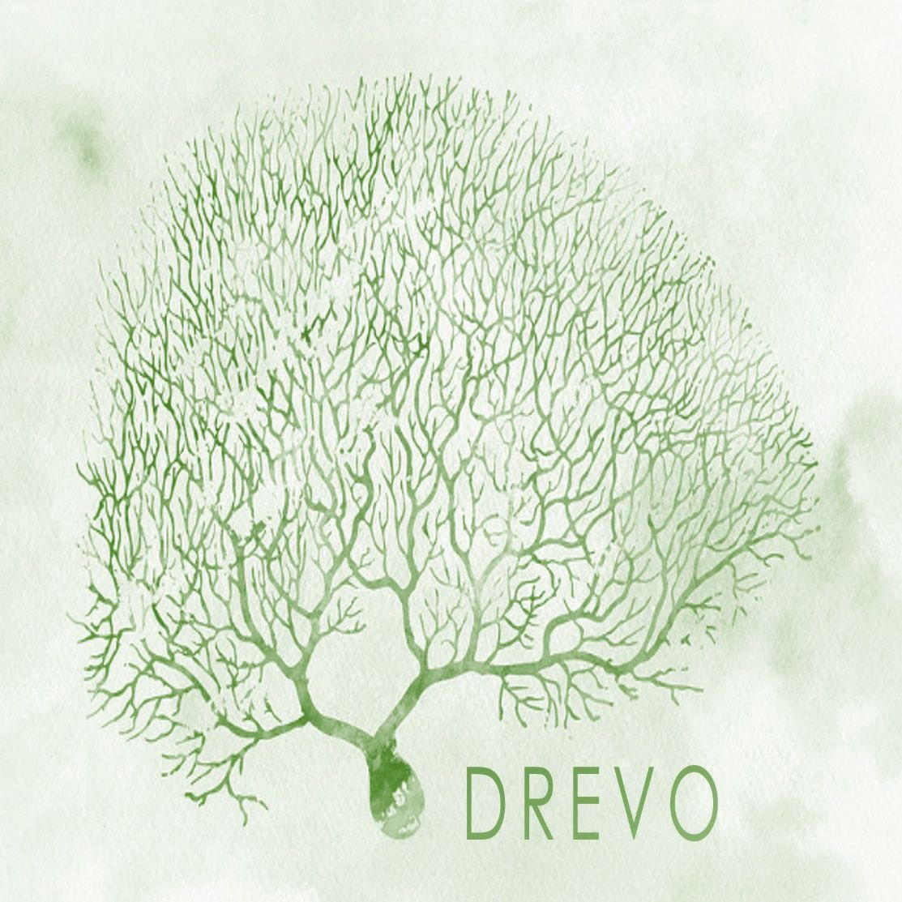

<div align="center">
    
    <h1>DREVO</h1>
</div>

<p align="center">
    The platform for neural network tokenization on the blockchain
</p>

### Requirements

- Python 3.10
- Docker 28.2.2

## ⚡ Get Started

### 1. Run services

Go to the `/services` folder and run `docker compose` in the terminal.

```bash
docker compose up --build
```

### 2. Run example

Go to the folder `/examples/ArtLife_v1`, install dependencies in the terminal and run `main.py`

```bash
pip install -r requirements.txt
python main.py
```
